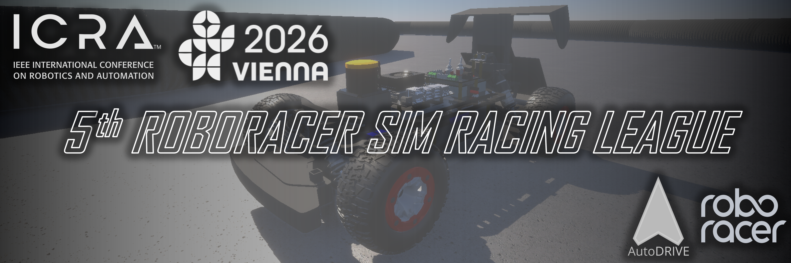

# RoboRacer Sim Racing League @ ICRA 2026

## About

<b>RoboRacer Autonomous Racing</b> is a semi-regular competition organized by an international community of researchers, engineers, and autonomous systems enthusiasts. The teams participating in the <b>27th RoboRacer Autonomous Racing Competition</b> at <a href="https://2026.ieee-icra.org">ICRA 2026</a> will write software for a 1:10 scaled autonomous racecar to fulfill the objectives of the competition: <b><i>drive fast but don’t crash!</i></b>

This time, we are organizing the fifth <b>RoboRacer Sim Racing League</b>, which leverages <a href="https://autodrive-ecosystem.github.io">AutoDRIVE Ecosystem</a> to model and simulate the digital twin of a RoboRacer racecar within a virtual racetrack. Please see the accompanying video for a glimpse of the RoboRacer digital twins in action.

<iframe style="aspect-ratio: 16/9; width: 100% !important;" src="https://www.youtube.com/embed/Rq7Wwcwn1uk?si=ngvop2-SfJJOIjWJ" title="Digital Twin of RoboRacer in AutoDRIVE Simulator" frameborder="0" allow="accelerometer; autoplay; clipboard-write; encrypted-media; gyroscope; picture-in-picture; web-share" referrerpolicy="strict-origin-when-cross-origin" allowfullscreen></iframe>

The main focus of the Sim Racing League is a virtual competition with simulated cars and environments, which is accessible to everyone across the globe. For the <a href="https://2026.ieee-icra.org">ICRA 2026</a> competition, each team will be provided with a standardized simulation setup (in the form of a digital twin of the RoboRacer vehicle, and a digital twin of the Porto racetrack) within the high-fidelity <a href="https://github.com/Tinker-Twins/AutoDRIVE/tree/AutoDRIVE-Simulator">AutoDRIVE Simulator</a>. Additionally, teams will also be provided with a working implementation of the <a href="https://github.com/Tinker-Twins/AutoDRIVE/tree/AutoDRIVE-Devkit">AutoDRIVE Devkit</a> to get started with developing their autonomy algorithms. Teams will have to develop perception, planning, and control algorithms to parse the real-time sensor data streamed from the simulator and generate control commands to be fed back to the simulated vehicle.

The competition will take place in 2 stages:

<ul class="justify-list">
  <li><b>Qualification Race:</b> Teams will demonstrate their ability to complete multiple laps around the practice track without colliding with the track bounds at run time.</li>
  <li><b>Time-Attack Race:</b> Teams will compete against the clock, on a previously unseen racetrack, to secure a position on the leaderboard.</li>
</ul>

Since the vehicle, the sensors, the simulator, and the devkit are standardized, teams must develop robust racing algorithms that can deal with the uncertainties of an unseen racetrack.

!!! Tip
    If you are interested in autonomously racing physical RoboRacer vehicles, please check out the website for [27th RoboRacer Autonomous Racing Competition](https://icra2026-race.roboracer.ai), which will be held in person at <a href="https://2026.ieee-icra.org">ICRA 2026</a>. You can always register and compete in both physical and virtual competitions!

## Organizers

|  |  |  |  |
|:------------------:|:-------------------:|:-------------------:|:-------------------:|
| [**Dr. Rahul Mangharam**](https://www.seas.upenn.edu/~rahulm) | [**Dr. Venkat Krovi**](https://www.clemson.edu/cecas/departments/automotive-engineering/people/venkat-krovi.html) | [**Dr. Radu Grosu**](https://tiss.tuwien.ac.at/person/248818.html) | [**Dr. Ezio Bartocci**](https://tiss.tuwien.ac.at/person/251490.html) |
|  |  |  |  |
| [**Dr. Johannes Betz**](https://www.professoren.tum.de/en/betz-johannes) | [**Chinmay Samak**](https://tinker-twins.github.io) | [**Tanmay Samak**](https://tinker-twins.github.io) | [**Ahmad Amine**](https://ahmadamine998.github.io) |

## Timeline

!!! warning
    Timeline is subject to change. Please keep checking this page for any updates.

| DATE                              | EVENT                          |
|:----------------------------------|:-------------------------------|
| Feb 23, 2026                      | Registration Opens             |
| Apr 30, 2026                      | Registration Closes            |
| May 09, 2026                      | Qualification Round Submission |
| May 10, 2026                      | Qualification Round Evaluation |
| May 11, 2026                      | Qualification Results Declared |
| May 12, 2026                      | Competition Track Released     |
| May 16, 2026                      | Final Race Submission          |
| May 17, 2026                      | Final Race Evaluation          |
| May 18, 2026                      | Competition Results Declared   |

Following is a brief summary of each event:

<ul class="justify-list">
  <li><b>Registration:</b> Interested teams will register for the Sim Racing League.</li>
  <li><b>Qualification Round:</b> Teams will demonstrate successful completion of 10 laps around the practice track provided ahead of time.</li>
  <li><b>Qualification Results:</b> Standings of all the qualified teams will be released.</li>
  <li><b>Competition Track:</b> Organizers will release the actual "competition track", which will be used for the final race. This track may be replicated in the physical race as well.</li>
  <li><b>Final Race:</b> Organizers will collect containerized algorithms from each team and connect them with the containerized simulator. Performance metrics of each team will be recorded.</li>
  <li><b>Competition Results:</b> Standings of all the teams for the final race will be released.</li>
</ul>

!!! info
    The RoboRacer Sim Racing League will be held approximately 1 week ahead of <a href="https://2026.ieee-icra.org">ICRA 2026</a> and the performance metrics will be made available to the teams. Discussions are underway with the ICRA organizing team to allow teams to analyze and present their approach/results in a short (~10 min) presentation in a special session at <a href="https://2026.ieee-icra.org">ICRA 2025</a>.

## Resources

<a href="https://autodrive-ecosystem.github.io/">AutoDRIVE</a> is envisioned to be an open, comprehensive, flexible and integrated cyber-physical ecosystem for enhancing autonomous driving research and education. It bridges the gap between software simulation and hardware deployment by providing the <a href="https://github.com/Tinker-Twins/AutoDRIVE/tree/AutoDRIVE-Simulator">AutoDRIVE Simulator</a> and <a href="https://github.com/Tinker-Twins/AutoDRIVE/tree/AutoDRIVE-Testbed">AutoDRIVE Testbed</a>, a well-suited duo for real2sim and sim2real transfer targeting vehicles and environments of varying scales and operational design domains. It also offers <a href="https://github.com/Tinker-Twins/AutoDRIVE/tree/AutoDRIVE-Devkit">AutoDRIVE Devkit</a>, a developer's kit for rapid and flexible development of autonomy algorithms using a variety of programming languages and software frameworks. For the Sim Racing League, teams will develop their autonomous racing algorithms using the AutoDRIVE Devkit to interface with the AutoDRIVE Simulator in real-time.

<a href="https://roboracer.ai">RoboRacer</a> is an <a href="https://roboracer.ai/about">international community</a> of researchers, engineers, and autonomous systems enthusiasts. It is centered around the idea of converting a 1:10 scale RC car into an autonomous vehicle for research and education; check out the <a href="https://roboracer.ai/build">documentation</a> to build your own RoboRacer autonomous racecar. Additionally, if you are new to the field of autonomous racing, you can refer to the complete <a href="https://roboracer.ai/learn">course material</a>, which is open sourced. If you already have some experience with autonomous racing, feel free to delve deeper into the <a href="https://roboracer.ai/research">research</a> enabled by RoboRacer. Lastly, you can also check out the physical <a href="https://roboracer.ai/race">RoboRacer races</a> that are being organized all around the world. For the Sim Racing League, teams will not require a physical RoboRacer vehicle; however, the learning resources can certainly be useful to get your autonomous racing fundamentals right!

We recommend all the teams interested in participating in the RoboRacer Sim Racing League to get accustomed with the competition. Following are a few resources to get you started:

-   :material-file-document:{ .lg .middle } __Competition Documents__

    ---

    Learn about the competition rules and technical aspects of the framework.

    [:material-open-in-new: **Competition Rules**](../roboracer-sim-racing-rules-2026)

    [:material-open-in-new: **Technical Guide**](../roboracer-sim-racing-guide-2026)

-   :material-docker:{ .lg .middle } __Docker Containers__

    ---

    Download base container images for the competition and start developing your algorithms.

    [:material-open-in-new: **AutoDRIVE Simulator:**](https://hub.docker.com/r/autodriveecosystem/autodrive_roboracer_sim) [`explore`](https://hub.docker.com/layers/autodriveecosystem/autodrive_roboracer_sim/2026-icra-explore/images/sha256-20c0bf5806d05d779388a0263c67885741a05412f33c00cde019d9668627adb3) | [`practice`](https://hub.docker.com/layers/autodriveecosystem/autodrive_roboracer_sim/2026-icra-practice/images/sha256-264e3946dc4ff199d667caa65b3bebc1829822acf201a3a33e7aa406bc574441) | `compete`

    [:material-open-in-new: **AutoDRIVE Devkit:**](https://hub.docker.com/r/autodriveecosystem/autodrive_roboracer_api) [`explore`](https://hub.docker.com/layers/autodriveecosystem/autodrive_roboracer_api/2026-icra-explore/images/sha256-8d2663bece059f54e628a8ebfa79237592b09c584545d64c465112b1899a52aa) | [`practice`](https://hub.docker.com/layers/autodriveecosystem/autodrive_roboracer_api/2026-icra-practice/images/sha256-133c366f472fc30e9fb27dbc0a71daa3b478b9d7d9ffc5e28bb6877d5d840a46) | `compete`

-   :material-monitor:{ .lg .middle } __Local Resources__

    ---

    Get started with the competition framework locally, and worry about containerization later. 

    **AutoDRIVE Simulator:**
    
    `explore`&nbsp;&nbsp;&nbsp; [:simple-linux: Linux](https://github.com/AutoDRIVE-Ecosystem/AutoDRIVE-RoboRacer-Sim-Racing/releases/download/2026-icra/autodrive_simulator_explore_linux.zip) | [:material-microsoft: Windows](https://github.com/AutoDRIVE-Ecosystem/AutoDRIVE-RoboRacer-Sim-Racing/releases/download/2026-icra/autodrive_simulator_explore_windows.zip) | [:simple-apple: macOS](https://github.com/AutoDRIVE-Ecosystem/AutoDRIVE-RoboRacer-Sim-Racing/releases/download/2026-icra/autodrive_simulator_explore_macos.zip)

    `practice`&nbsp; [:simple-linux: Linux](https://github.com/AutoDRIVE-Ecosystem/AutoDRIVE-RoboRacer-Sim-Racing/releases/download/2026-icra/autodrive_simulator_practice_linux.zip) | [:material-microsoft: Windows](https://github.com/AutoDRIVE-Ecosystem/AutoDRIVE-RoboRacer-Sim-Racing/releases/download/2026-icra/autodrive_simulator_practice_windows.zip) | [:simple-apple: macOS](https://github.com/AutoDRIVE-Ecosystem/AutoDRIVE-RoboRacer-Sim-Racing/releases/download/2026-icra/autodrive_simulator_practice_macos.zip)

    `compete`&nbsp;&nbsp;&nbsp; :simple-linux: Linux | :material-microsoft: Windows | :simple-apple: macOS

    **AutoDRIVE Devkit:**
    
    [:simple-ros: ROS 2](https://github.com/AutoDRIVE-Ecosystem/AutoDRIVE-RoboRacer-Sim-Racing/releases/download/2026-icra/autodrive_devkit.zip)

-   :octicons-link-16:{ .lg .middle } __Quick Links__

    ---

    Links to be kept at your fingertips, for a smooth ride throughout the competition.

    **Schedule:** [:material-calendar-clock: Timeline](#timeline)

    **Registration:** [:material-file-document-edit: Form](https://forms.gle/RBcH2k4LU49FiGth7)
    
    **Documentation:** [:material-file-document: Rule Book](../roboracer-sim-racing-rules-2026) | [:material-file-document: Tech Guide](../roboracer-sim-racing-guide-2026)

    **Communication:** [:material-slack: Slack](https://join.slack.com/t/autodrive-ecosystem/shared_invite/zt-2oeg2hce8-0JvasvnBM1M_wUdDTWRuKw)

    **Submission:** [:material-file-document-edit: Phase 1](https://forms.gle/hshuuLocosuvhPoE8) | :material-file-document-edit: Phase 2

    **Results:** [:fontawesome-solid-trophy: Phase 1](#results) | [:fontawesome-solid-trophy: Phase 2](#results)

!!! question
    You can post general questions on the [:material-slack: AutoDRIVE Slack](https://join.slack.com/t/autodrive-ecosystem/shared_invite/zt-2oeg2hce8-0JvasvnBM1M_wUdDTWRuKw) workspace; this is the preferred modality. Technical questions can be also posted as [:material-github: GitHub Issues](https://github.com/AutoDRIVE-Ecosystem/AutoDRIVE-RoboRacer-Sim-Racing/issues) or [:material-github: GitHub Discussions](https://github.com/AutoDRIVE-Ecosystem/AutoDRIVE-RoboRacer-Sim-Racing/discussions). For any other questions or concerns that cannot be posted publicly, please contact [:material-email: Chinmay Samak](mailto:csamak@clemson.edu) or [:material-email: Tanmay Samak](mailto:tsamak@clemson.edu).

## Registration

This competition is open to everyone around the world - students, researchers, hobbyists, professionals, or anyone else who is interested. A team can consist of multiple teammates. Teams with only one person are also allowed. However, a person cannot be a part of more than one team.

<a class="md-button" href="https://forms.gle/RBcH2k4LU49FiGth7"><svg xmlns="http://www.w3.org/2000/svg" viewBox="0 0 24 24"><path d="M6 2c-1.11 0-2 .89-2 2v16a2 2 0 0 0 2 2h4v-1.91L12.09 18H6v-2h8.09l2-2H6v-2h12.09L20 10.09V8l-6-6H6m7 1.5L18.5 9H13V3.5m7.15 9.5a.55.55 0 0 0-.4.16l-1.02 1.02 2.09 2.08 1.02-1.01c.21-.22.21-.58 0-.79l-1.3-1.3a.544.544 0 0 0-.39-.16m-2.01 1.77L12 20.92V23h2.08l6.15-6.15-2.09-2.08Z"/></svg> Registration Form</a>

Registration for the Sim Racing League is free of cost and separate from the Physical Racing League and the conference/event registrations themselves. The above form signs you up only for the Sim Racing League. Although you can participate in the Sim Racing League without attending the conference/event, we strongly encourage all competition participants to attend the conference/event in person. This will help you connect with the broader AutoDRIVE and RoboRacer communities, and you can also witness/participate in the physical RoboRacer autonomous racing competition!

Registered teams are added to the following table:

| SR. NO. | TEAM NAME                 | TEAM MEMBERS                  | ORGANIZATION                              | COUNTRY                              |
|:--------|:--------------------------|:------------------------------|:------------------------------------------|:-------------------------------------|
| 01      | Neuromorphic Racer        | Joy Vithayathil               | Indian Institute of Technology (ISM), Dhanbad | India                            |
| 02      | Macan Malaya              | Giovanni Dejan                | Universiti Malaya                         | Indonesia                            |
| 03      | AutoTurbo                 | Pavan Kalyan Majjiga          | Barigo Holdings, Inc.                     | United States of America (USA)       |
| 04      | HSMNF Racer               | Hamdan AlHajeri Mohammed Islam Maher Abdul Gafoor Feras Shihab Nevan John Thomas | Khalifa University | United Arab Emirates (UAE) |
| 05      | Abdulrahman Mahmoud       | Abdulrahman Mahmoud           | Personal                                  | Egypt                                |
| 06      | KU - TeamOne              | Shahad Rikas Zain Hasan Ahzem Manzeer Ahmed Zeeshan Harinath Ranjit | Khalifa University | United Arab Emirates (UAE) |
| 07      | Maxed-Out                 | Greg Maxwell                  | Personal                                  | United States of America (USA)       |
| 08      | Black Arrow               | Aswin Srinivasan Dinesh Kumar Venkatachalapathy Rohit Hemachandra Pillai Sree Raadhai Manikanda Sharma Aravindhakumar Manimaran Tharun Kamaraj Magadapalli Sathyanarayanan Shanmugadasan Ravi Sri Vaishnavi Sudapalli Charisma Tammina Khushi Naik | Personal | Germany |
| 09      | MoonLit Robotix           | Karthik Nambiar Ayushman Saha Deepanshu Raj | Indian Institute of Science Education and Research, Bhopal | India |
| 10      | KU SPARCy                 |Zayed Muhammad Abdullah Haider Saif Mohamed Abdelmaksoud Sulaiman AbuQamar Hanadi Aljeaidi Dana Alkindi Ghala Alblooshi | Khalifa University | United Arab Emirates (UAE) |
| 11      | bracavisionai             | Luis Bracamontes              | bracavisionai                             | Mexico                               |
| 12      | Dexter Dynamics           | Abhinav Joshi                 | Personal                                  | India                                |
| 13      | Purdue Autonomous Racing  | Jayesh Fasate Bala Malla Reddy Kolanu Joel Antony Bakkiyanathan Rishi Ramkumar Vikas Vivek | Purdue University | United States of America (USA) |
| 14      | Team Lone Warrior         | Abdullah Bin Naeem            | National University of Computer and Emerging Sciences | Pakistan                 |
| 15      | BitHunters                | Abin Shaji Thomas             | Karunya Institute of Technology and Sciences | India                             |
| 16      | Knightrix                 | Shubham Barge                 | Personal                                     | India                             |
| 17      | MonacoF1                  | Gerardo Puga Emiliano Alban Naranjo Michel Hidalgo | Ekumen          | Argentina, Ecuador                |
| 18      | Space Lab                 | Haorong Yuan Shengyao Lan | Shenzhen University                          | China                             |
| 19      | Async Late Night Runner   | EuJin Tan                     | Personal                                     | Malaysia                          |
| 20      | CRXL                      | Ujjval Patel                  | CaliberX Research Labs                       | India                             |
| 21      | Nova                      | Dr. K. Lakshmi Prasanna Sankalp Telasang Abhay Ayyalasomayajula Shreyas Kamalapuram Yash Bhatt Vaishnavi | Birla Institute of Technology and Science (BITS) Pilani Work Integrated Learning Programmes (WILP) | India |
| 22      | Dagozilla Racing Team     | Muhammad Adli Syauqi Sami Fauzan Ramadhan Adri Firmansya Sofyan Sulthan Naufal Affan Kenny Pramanik Najla Wibowo Muhammad Zaki Azzamy Syauqi Raegrand Archamadeus Ahmad Sahro Habibie Muhammad Ghifari | Bandung Institute of Technology | Indonesia |
| 23      | AM warm-up NC26           | Abdulrahman Yasser Sama Ahmed Osama Farouk Sajda Mohammed Mohmmed Abbas Seif  Eldaby Aisha Ahmed Mohamed Steven Joseph Mohamed Elgohary Jana Mahmoud Ahmed Ashraf Hashem | Assiut University | Egypt |
| 24      | JARVIS                    | N Rohit Balaji Sujal Choudary | SRM Institute of Science and Technology  | India                             |
| 25      | determination             | Fagr Ahmed                    | Egypt-Japan University of Science and Technology | Egypt                         |
| 26      | Penn RoboRacer            | Keshav Mohta Ananya Bhat Ashwin Krishnaswamy Zhaoqi Wang Deniz Gursoy Yatin Bayya Deepa Lokesha | University of Pennsylvania | United States of America (USA) |
| 27      | Apex Predator             | Taaha Saleem Bajwa            | Personal                                     | Pakistan                          |
| 28      | Simracer                  | Dominik Schneider             | Personal                                     | Germany                           |
| 29      | DEWO SPEED                | Bima Aditya Pratama Afrizal Luthfi Eka Arnatha Aleminaitha Kerina Beru Ginting Faiz Muhammad Hakim Galih Ramadhani Muhamad Muhamad Alvi Kirana Zulfan Nazal Muhammad Hisyam Adiansyah | Universitas Negeri Surabaya | Indonesia |
| 30      | KUF1Tenth                 | Jackson Yanek Tyler Oswald Nickan Safi | University Of Kansas        | United States of America (USA)    |
| 31      | RUN-RUN-ChuraTaro         | Soya Aoki                     | Chura DATA Inc.                              | Japan                             |
| 32      | MooN-Racer                | Pavan Rajak Rishabh Mittal | Indian Institute of Science Education and Research, Bhopal | India              |
| 33      | racingIllini              | Sidhant Jha Adrian Mittal Siddhant Shankar Bryan Zhang | University of Illinois at Urbana Champaign (UIUC) | United States of America (USA) |
| 34      | JKU-ITS                   | Aida Rostamza Joshua Cherian Varughese Gaspar Garcia Gutierrez Husam Issa | Johannes Kepler University Linz - Intelligent Transport Systems | Austria |
| 35      | Bhuna Khichuri Racers     | Al Mahir Ahmed Suhail Haque Rafi | BRAC University                       | Bangladesh                        |
| 36      | AutoJim                   | Demetris H                    | Personal                                     | Cyprus                            |
| 37      | Tarek Alhafez             | Tarek Alhafez                 | Personal                                     | United Arab Emirates              |
| 38      | NTU DeepSpeed             | Ting-Ju Chen Baba Purandara Moolya Chennupati Sri Siva Sai Abhiram Eduardo Fernandes de Conto Kah Lok Wong Mu-En Li Raditya Chema Hafizh Pradigta S Sarvajana Hari Yun-Tung Lee | Nanyang Technological University | Singapore |
| 39      | Prakhar                   | Prakhar Dwivedi               | Personal                                     | India                             |
| 40      | IDEA_LAB                  | SuJin Park SinHo Cho JongAh Ha | Gyeongsang National University      | South Korea                       |
| 41      | SuperRace                 | Jisu Lee                      | Hanyang University                           | South Korea                       |
| 42      | rumba                     | Rujhan Najib                  | Personal                                     | Malaysia                          |
| 43      | Shiam                     | Shiam Chuttoo                 | Personal                                     | United Kingdom                    |
| 44      | Nineyards Robotics        | Alistair English              | Personal                                     | Australia                         |
| 45      | IU Luddy Roboracer Team   | Shreyaj Kankipati Arav Pushkar | Indiana University                      | United States of America (USA)    |
| 46      | SpeedTiger                | Alexander Krolicki            | Personal                                     | United States of America (USA)    |
| 47      | Omega_assassin's          | Akash Kanagala                | Personal                                     | India                             |
| 48      | YalaAE                    | Bushra AlShehhi               | Personal                                     | United Arab Emirates (UAE)        |
| 49      | Innomer                   | Mann Bhanushali               | Personal                                     | India                             |
| 50      | Nehal Sonawane            | Nehal Sonawane                | Personal                                     | United States of America (USA)    |
| 51      | IKERLAN - F1Tenth         | Asier Caballero Andoni Amurrio Haritz Odriozola | IKERLAN            | Spain                             |
| 52      | FOCAS                     | Archana Kulkarni Soumyodipta Nath | Indian Institute of Science (IISc)   | India                             |
| 53      | Raghav                    | Raghav Toshniwal              | Personal                                     | India                             |
| 54      | SUST AUTODRIVE            | Abul Bashar Raz Ehsanul Karim Aslam Redwan Hassan Nayeem Islam Shanto Hasan Marjuk | SUST AUTODRIVE | Bangladesh |
| 55      | PromptEngines             | Ruan Delport                  | Personal                                     | South Africa                      |
| 56      | Infinity                  | Nilesh TN Harish A Kumar | Personal                                  | India                             |
| 57      | Gator Autonomous Racing   | Christopher Oeltjen Sriram Yerramsetty Angela Nguyen Layla Hernandez Rishi Gandi Sunny Gupta Timothy Macias Walter Wieler | University of Florida | United States of America (USA) |
| 58      | Fast3                     | Abdulla Alhammadi             | Khalifa University                           | United Arab Emirates (UAE)        |
| 59      | Delulu Underdogs          | Karun Ashok Kumar Leonie Hoekstra Luuk Lenders | University of Twente | Netherlands                      |
| 60      | Vibe_racer                | Ruan Delport                  | Personal                                     | South Africa                      |
| 61      | We ain't slippin          | Niklas Holle                  | Personal                                     | Germany                           |

!!! note
    The above table will be updated with newly registered teams within a few days of registration. Please contact [:material-email: Chinmay Samak](mailto:csamak@clemson.edu) or [:material-email: Tanmay Samak](mailto:tsamak@clemson.edu) if you do not see your team entry for more than 7 days after registering.

<!-- 

<iframe style="aspect-ratio: 16/8; width: 100% !important;" src="/../assets/images/competitions/2026 icra roboracer sim racing league/Map.html" title="Global Participation Map"  frameborder="0"></iframe>

 -->

## Submission

Each team is expected to submit a containerized version of their autonomous racing software stack. Submissions for each phase of the competition will be handled separately.

!!! note
    We expect that upon running your submitted container, all the necessary nodes should start up (the `autodrive_devkit` API we have included as well as your team's racing stack). Once we hit the `Connection Button` on the `Menu Panel` of AutoDRIVE Simulator, the simulated vehicle should start running. Please make sure that you include all the necessary commands (for sourcing workspaces, setting environment variables, launching nodes, etc.) within the `entrypoint` script (`autodrive_devkit.sh` file) provided within the `autodrive_roboracer_api` container. Please do **NOT** use `~/.bashrc` or other means to automate the algorithm execution! Competition organizers should be able to start additional bash session(s) within your submitted container (without your codebase executing every time a new bash session is initialized) for data recording and inspection purposes. Also, make sure to add detailed instructions to your [Docker Hub repository overview](https://docs.docker.com/docker-hub/repos/manage/information#repository-overview), which explains how to download (specific `tag`) and run your container image step-by-step.

Use the secure form below to make your team's submission for Phase 1 (Qualification Round) of the RoboRacer Sim Racing League. Please fill in your team's name and add the link to your team's DockerHub repository containing the autonomous racing stack. If you are using a private repository, make sure to add <a href="https://hub.docker.com/u/autodriveecosystem">autodriveecosystem</a> as a <a href="https://docs.docker.com/docker-hub/repos/manage/access/#collaborators">collaborator to your repository</a>.

<a class="md-button" href="https://forms.gle/hshuuLocosuvhPoE8"><svg xmlns="http://www.w3.org/2000/svg" viewBox="0 0 24 24"><path d="M6 2c-1.11 0-2 .89-2 2v16a2 2 0 0 0 2 2h4v-1.91L12.09 18H6v-2h8.09l2-2H6v-2h12.09L20 10.09V8l-6-6H6m7 1.5L18.5 9H13V3.5m7.15 9.5a.55.55 0 0 0-.4.16l-1.02 1.02 2.09 2.08 1.02-1.01c.21-.22.21-.58 0-.79l-1.3-1.3a.544.544 0 0 0-.39-.16m-2.01 1.77L12 20.92V23h2.08l6.15-6.15-2.09-2.08Z"/></svg> Phase 1 Submission Form</a>

!!! warning
    Phase 1 submission window will close on May 09, 2026 (anywhere on Earth). Please contact [:material-email: Chinmay Samak](mailto:csamak@clemson.edu) or [:material-email: Tanmay Samak](mailto:tsamak@clemson.edu) if you have any questions.

Use the secure form below to make your team's submission for Phase 2 (Final Race) of the RoboRacer Sim Racing League. Please fill in your team's name and add the link to your team's DockerHub repository containing the autonomous racing stack. If you are using a private repository, make sure to add <a href="https://hub.docker.com/u/autodriveecosystem">autodriveecosystem</a> as a <a href="https://docs.docker.com/docker-hub/repos/manage/access/#collaborators">collaborator to your repository</a>.

<a class="md-button" href=""><svg xmlns="http://www.w3.org/2000/svg" viewBox="0 0 24 24"><path d="M6 2c-1.11 0-2 .89-2 2v16a2 2 0 0 0 2 2h4v-1.91L12.09 18H6v-2h8.09l2-2H6v-2h12.09L20 10.09V8l-6-6H6m7 1.5L18.5 9H13V3.5m7.15 9.5a.55.55 0 0 0-.4.16l-1.02 1.02 2.09 2.08 1.02-1.01c.21-.22.21-.58 0-.79l-1.3-1.3a.544.544 0 0 0-.39-.16m-2.01 1.77L12 20.92V23h2.08l6.15-6.15-2.09-2.08Z"/></svg> Phase 2 Submission Form</a>

!!! warning
    Phase 2 submission window will close on May 16, 2026 (anywhere on Earth). Please contact [:material-email: Chinmay Samak](mailto:csamak@clemson.edu) or [:material-email: Tanmay Samak](mailto:tsamak@clemson.edu) if you have any questions.

## Results

**Phase 1: Qualification**

Phase 1 results will be posted here on May 11, 2026.

<!-- 

The following teams have qualified for the final time-attack race. Here are the official standings:

| RANK    | TEAM NAME                       | RACE TIME       | COLLISION COUNT | ADJUSTED RACE TIME | BEST LAP TIME | VIDEO                                                      |
|:--------|:--------------------------------|:----------------|:----------------|:-------------------|:--------------|:-----------------------------------------------------------| -->

**Phase 2: Competition**

Phase 2 results will be posted here on May 18, 2026.

<!-- 

The following teams successfully finished the final time-attack race. Here are the official standings:

| RANK    | TEAM NAME                       | RACE TIME       | COLLISION COUNT | ADJUSTED RACE TIME | BEST LAP TIME | VIDEO                                                      |
|:--------|:--------------------------------|:----------------|:----------------|:-------------------|:--------------|:-----------------------------------------------------------| -->

## Summary

A summary video will be posted here after the competition.

<!-- 

<iframe style="aspect-ratio: 16/9; width: 100% !important;" src="https://www.youtube.com/embed/7Y2jeoHyvWA?si=KdvjI2Aawu4Vv3xN" title="RoboRacer Sim Racing League @ CDC-TF 2025" frameborder="0" allow="accelerometer; autoplay; clipboard-write; encrypted-media; gyroscope; picture-in-picture; web-share" referrerpolicy="strict-origin-when-cross-origin" allowfullscreen></iframe>

 -->