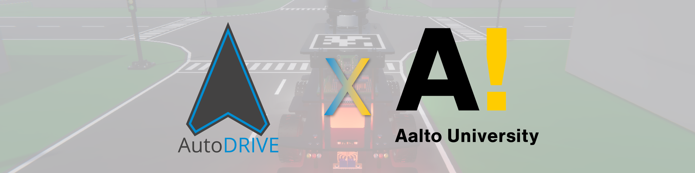

# EEA-EV008 @ Aalto University

## About

<a href="https://sisu.aalto.fi/student/courseunit/otm-3fb4f6fb-a67c-466b-993c-ce9dece84a78/brochure"><b>EEA-EV008: Visual Perception and Planning for Autonomous Driving</b></a> is a graduate-level course at Aalto University covering the fundamental concepts and practical methods underlying autonomous driving systems. The course focuses on how autonomous vehicles perceive their environment and plan safe, intelligent actions, spanning topics such as visual sensing, scene understanding, localization, decision-making, motion planning, and control. The course combines theoretical foundations with practical implementation, giving students an opportunity to work with concepts and tools relevant to modern autonomous driving research and development.

 

- :fontawesome-solid-graduation-cap:{ .lg .middle } __Course Overview__

    ---

    **Course Level:** Advanced Studies (5 cr)
    
    **Department:** Electrical Engineering and Automation (EEA)
    
    **Institution:** Aalto University

- :fontawesome-solid-graduation-cap:{ .lg .middle } __Course Listing__

    ---

    - <a href="https://sisu.aalto.fi/student/courseunit/otm-3fb4f6fb-a67c-466b-993c-ce9dece84a78/brochure"><b>Aalto University Sisu:</b> EEA-EV008</a>

    - <a href="https://www.linkedin.com/posts/azamshoaib_aalto-autonomousdriving-computervision-activity-7432048511350697985-KBiJ"><b>Shoaib Azam:</b> LinkedIn Announcement</a>

    - <a href="https://www.linkedin.com/posts/furkan-yard%C4%B1mc%C4%B1-48513a239_turkish-below-im-excited-to-share-that-activity-7431758729827688448-tk4A"><b>Furkan Yardımcı:</b> LinkedIn Announcement</a>

- :fontawesome-solid-graduation-cap:{ .lg .middle } __Learning Outcomes__

    ---

    - Describe the architecture and key challenges of autonomous driving systems, including perception, planning, control, and localization.

    - Develop autonomous driving modules using <a href="https://www.ros.org">ROS 2</a> and <a href="https://autodrive-ecosystem.github.io">AutoDRIVE Ecosystem</a>, including perception, planning, and control algorithms.

    - Implement deep learning models for perception tasks such as lane detection, object detection, segmentation, and depth estimation using multi-modal sensor data.

    - Design and evaluate motion planning strategies for autonomous navigation in simulated environments.

- :fontawesome-solid-graduation-cap:{ .lg .middle } __Course Content__

    ---

    - Introduction to Autonomous Driving

    - Vehicle Dynamics and Control
    
    - Rigid Body Transformations

    - Localization

    - Path Planning

    - Motion Planning

    - Deep Learning Fundamentals

    - Object Detection, Segmentation, and Depth Estimation

    - Imitation Learning

## Instructors

|  |  |  |
|:------------------:|:-------------------:|:-------------------:|
| [**Dr. Shoaib Azam**](https://www.aalto.fi/en/people/shoaib-azam) shoaib.azam@aalto.fi Instructor | [**Dr. Ville Kyrki**](https://www.aalto.fi/en/people/ville-kyrki) ville.kyrki@aalto.fi Instructor | [**Furkan Yardımcı**](https://www.linkedin.com/in/furkan-yard%C4%B1mc%C4%B1-48513a239) furkan.yardimci@aalto.fi Teaching Assistant |

## Resources

This course is powered by <a href="https://autodrive-ecosystem.github.io">AutoDRIVE Ecosystem</a>, where students work closely with <b><i>Nigel</i></b> — a 1:14 scale autonomous vehicle platform. Please see the accompanying video for a glimpse of Nigel in AutoDRIVE Ecosystem.

<iframe style="aspect-ratio: 16/9; width: 100% !important;" src="https://www.youtube.com/embed/t0CgNR_LgrQ?si=eQyKijSKQIv5Wjyh" title="AutoDRIVE Ecosystem" frameborder="0" allow="accelerometer; autoplay; clipboard-write; encrypted-media; gyroscope; picture-in-picture; web-share" referrerpolicy="strict-origin-when-cross-origin" allowfullscreen></iframe>

<a href="https://autodrive-ecosystem.github.io/">AutoDRIVE</a> is envisioned to be an open, comprehensive, flexible and integrated cyber-physical ecosystem for enhancing autonomous driving research and education. It bridges the gap between software simulation and hardware deployment by providing the <a href="https://github.com/Tinker-Twins/AutoDRIVE/tree/AutoDRIVE-Simulator">AutoDRIVE Simulator</a> and <a href="https://github.com/Tinker-Twins/AutoDRIVE/tree/AutoDRIVE-Testbed">AutoDRIVE Testbed</a>, a well-suited duo for real2sim and sim2real transfer targeting vehicles and environments of varying scales and operational design domains. It also offers <a href="https://github.com/Tinker-Twins/AutoDRIVE/tree/AutoDRIVE-Devkit">AutoDRIVE Devkit</a>, a developer's kit for rapid and flexible development of autonomy algorithms using a variety of programming languages and software frameworks. For this course, students will develop their autonomous driving algorithms using the AutoDRIVE Devkit to interface with the AutoDRIVE Simulator in real-time.

The tech stack for this course has been released:

- :material-car:{ .lg .middle } __AutoDRIVE Simulator__

    ---

    :material-monitor: **Local Resources:** [:simple-linux: Linux](https://github.com/AutoDRIVE-Ecosystem/AutoDRIVE-Aalto-University-Course/releases/download/v1.0.0/autodrive_simulator_nigel_linux.zip) | [:material-microsoft: Windows](https://github.com/AutoDRIVE-Ecosystem/AutoDRIVE-Aalto-University-Course/releases/download/v1.0.0/autodrive_simulator_nigel_windows.zip) | [:simple-apple: macOS](https://github.com/AutoDRIVE-Ecosystem/AutoDRIVE-Aalto-University-Course/releases/download/v1.0.0/autodrive_simulator_nigel_macos.zip)

    :material-docker: **Docker Containers:** [:material-docker: Docker Hub](https://hub.docker.com/r/autodriveecosystem/autodrive_nigel_sim)

    :material-file-document: **Documentation:** [:material-github: GitHub](https://github.com/AutoDRIVE-Ecosystem/AutoDRIVE-Aalto-University-Course/blob/main/autodrive_simulator/README.md)

- :material-file-code:{ .lg .middle } __AutoDRIVE Devkit__

    ---

    :material-monitor: **Local Resources:** [:simple-ros: ROS 2](https://github.com/AutoDRIVE-Ecosystem/AutoDRIVE-Aalto-University-Course/releases/download/v1.0.0/autodrive_devkit.zip)

    :material-docker: **Docker Containers:** [:material-docker: Docker Hub](https://hub.docker.com/r/autodriveecosystem/autodrive_nigel_api)

    :material-file-document: **Documentation:** [:material-github: GitHub](https://github.com/AutoDRIVE-Ecosystem/AutoDRIVE-Aalto-University-Course/blob/main/autodrive_devkit/README.md)

