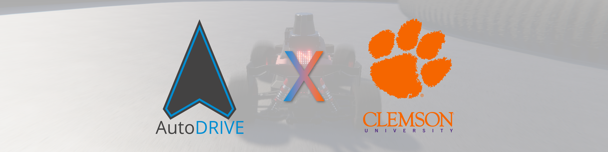

# AuE-4930/6930 @ Clemson University

## About

<a href="https://clemson.simplesyllabus.com/en-US/doc/4xhobxetv/Fall-2026-AUE-6930-005-AuE-4930-6930-Autonomous-Vehicles:-Racing-Application?mode=view"><b>AuE-4930/6930: Autonomous Vehicles: Racing Application</b></a> is a mixed undergraduate/graduate-level course at Clemson University, which introduces the principles, strategies and implementation of AI/ML-enhanced vehicle autonomy (perception, localization, planning and control) deployments within an autonomous racing context. Real-world challenges/constraints from the racing context are used to motivate the systematic application of fundamental knowledge; modular hierarchical decomposition; comparative evaluation and down-selection at the component, subsystem, and system-levels; and scaffolded homeworks, sub-projects, and end-to-end capstone project realization with contemporaneous technologies.

 

- :fontawesome-solid-graduation-cap:{ .lg .middle } __Course Overview__

    ---

    **Course Level:** 4000/6000 Level Technical Elective (3 cr)
    
    **Department:** Automotive Engineering (AuE)
    
    **Institution:** Clemson University (CU-ICAR)

    **Modality:** On-Campus + Online (Asynchronous)

- :material-repeat:{ .lg .middle } __Course Motifs__

    ---

    - **Motif 1:** Autonomous Systems

    - **Motif 2:** Mechatronics Principles

    - **Motif 3:** Design Thinking

    - **Motif 4:** Digital Engineering

- :material-check-all:{ .lg .middle } __Learning Outcomes__

    ---

    - Learn core concepts of the fundamental autonomy sub-modules (perception, localization, planning, and control) for autonomous racing.

    - Analyze alternate design choices (within the sub-modules as well as the overall composed system) to inform the most effective end-to-end realization.
    
    - Work on scaffolded labs using the racecar digital twin to build theoretical understanding and practical skills for various implementation strategies.
    
    - Integrate and deploy autonomy algorithms onto the racecar physical twin to build theoretical understanding and practical skills for sim2real transfer.
    
    - Develop end-to-end autonomous racing stacks through rigorous capstone projects, and demonstrate, document and present them to a technical audiance.

- :material-format-list-bulleted-square:{ .lg .middle } __Course Content__

    ---

    - **M00: Autonomous Systems Engineering Onramp** Linux, Git/GitHub, Docker, ROS 2, AutoDRIVE, NeoRacer

    - **M01: Cyber-Physical Systems Engineering** Setup, Calibration, Telemetry, Teleoperation

    - **M02: Reactive Autonomous Driving Algorithms** AEB, Wall Following, Follow-the-Gap, Disparity Extender

    - **M03: Mapping, Localization, and SLAM** Odometry, Scan Matching, Pose Graph, Particle Filter

    - **M04: Path Planning and Raceline Optimization** Min. Distance, Min. Curvature, Min. Time Planning

    - **M05: Trajectory Tracking and Motion Control**  PID, Pure-Pursuit, Stanley, MPC, MPPI, MPCC, etc.

    - **M06: Autonomous Racing Competition** Project Demonstration, Documentation, Presentation

## Instructors

|  |  |  |  |
|:------------------:|:-------------------:|:-------------------:|:-------------------:|
| [**Dr. Venkat Krovi**](https://www.clemson.edu/cecas/departments/automotive-engineering/people/venkat-krovi.html) vkrovi@clemson.edu Course Instructor | [**Tanmay Samak**](https://www.linkedin.com/in/samaktanmay) tsamak@clemson.edu Teaching Assistant | [**Chinmay Samak**](https://www.linkedin.com/in/samakchinmay) csamak@clemson.edu Teaching Assistant | [**Pranav Korrapati**](https://www.linkedin.com/in/pranavkorrapati) pkorrap@clemson.edu <abbr title="Learning Management System">LMS</abbr> Support |

## Resources

<a href="https://autodrive-ecosystem.github.io">AutoDRIVE</a> is envisioned to be an open, comprehensive, flexible and integrated cyber-physical ecosystem for enhancing autonomous driving research and education. It bridges the gap between software simulation and hardware deployment by providing the <a href="https://github.com/Tinker-Twins/AutoDRIVE/tree/AutoDRIVE-Simulator">AutoDRIVE Simulator</a> and <a href="https://github.com/Tinker-Twins/AutoDRIVE/tree/AutoDRIVE-Testbed">AutoDRIVE Testbed</a>, a well-suited duo for real2sim and sim2real transfer targeting vehicles and environments of varying scales and operational design domains. It also offers <a href="https://github.com/Tinker-Twins/AutoDRIVE/tree/AutoDRIVE-Devkit">AutoDRIVE Devkit</a>, a developer's kit for rapid and flexible development of autonomy algorithms using a variety of programming languages and software frameworks.

<a href="https://neobotics.org/kits">NeoRacer</a> is a 1:12 scale autonomous racecar platform for research and education by the <a href="https://neobotics.org">Neobotics Foundation Inc.</a> It integrates onboard compute, sensing (LiDAR, global-shutter camera, IMU, and motor encoder), actuation (drive-by-wire and steer-by-wire), and vehicle interfaces into a compact Ackermann-steered 4WD chassis, providing the hardware foundation for autonomous vehicle development. The platform is accompanied by open-source <a href="https://neobotics.org/docs">documentation</a> covering the setup, hardware, software, interfaces, and development workflows.

For this course, students will develop their autonomous racing algorithms using the <b>AutoDRIVE Devkit</b> (ROS 2), safely prototype them within the <b>AutoDRIVE Simulator</b> (digital twin), and deploy them onto the <b>AutoDRIVE Testbed</b> (physical twin). Here, <a href="https://neobotics.org/kits">NeoRacer</a> serves as the reference vehicle platform for <a href="https://autodrive-ecosystem.github.io">AutoDRIVE</a>, with the corresponding high-fidelity, real2sim-calibrated digital twin represented in AutoDRIVE Simulator and the physical twin integrated into AutoDRIVE Testbed, which enables sim2real transfer and fielded deployment in the real world. AutoDRIVE Devkit provides a common <a href="https://www.ros.org">ROS 2</a> interface across the digital and physical twins, allowing students to develop and validate their autonomous racing algorithms in simulation and subsequently deploy them on the physical NeoRacer with consistent vehicle behavior and interfaces. Together, these components provide a unified development-to-deployment workflow spanning software, simulation, and hardware.

<!-- 

The tech stack for this course has been released:

- :material-car:{ .lg .middle } __AutoDRIVE Simulator__

    ---

    :material-monitor: **Local Resources:** [:simple-linux: Linux](https://github.com/AutoDRIVE-Ecosystem/AutoDRIVE-Aalto-University-Course/releases/download/v1.0.0/autodrive_simulator_nigel_linux.zip) | [:material-microsoft: Windows](https://github.com/AutoDRIVE-Ecosystem/AutoDRIVE-Aalto-University-Course/releases/download/v1.0.0/autodrive_simulator_nigel_windows.zip) | [:simple-apple: macOS](https://github.com/AutoDRIVE-Ecosystem/AutoDRIVE-Aalto-University-Course/releases/download/v1.0.0/autodrive_simulator_nigel_macos.zip)

    :material-docker: **Docker Containers:** [:material-docker: Docker Hub](https://hub.docker.com/r/autodriveecosystem/autodrive_nigel_sim)

    :material-file-document: **Documentation:** [:material-github: GitHub](https://github.com/AutoDRIVE-Ecosystem/AutoDRIVE-Aalto-University-Course/blob/main/autodrive_simulator/README.md)

- :material-file-code:{ .lg .middle } __AutoDRIVE Devkit__

    ---

    :material-monitor: **Local Resources:** [:simple-ros: ROS 2](https://github.com/AutoDRIVE-Ecosystem/AutoDRIVE-Aalto-University-Course/releases/download/v1.0.0/autodrive_devkit.zip)

    :material-docker: **Docker Containers:** [:material-docker: Docker Hub](https://hub.docker.com/r/autodriveecosystem/autodrive_nigel_api)

    :material-file-document: **Documentation:** [:material-github: GitHub](https://github.com/AutoDRIVE-Ecosystem/AutoDRIVE-Aalto-University-Course/blob/main/autodrive_devkit/README.md)

 -->